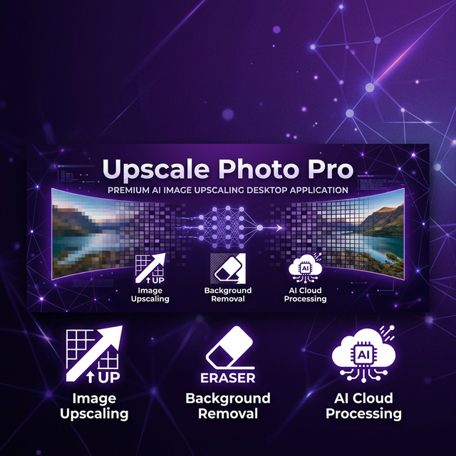
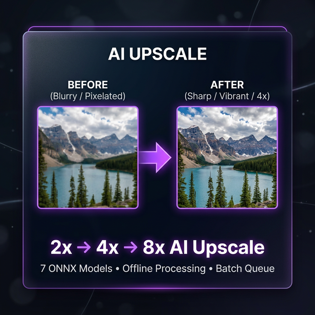
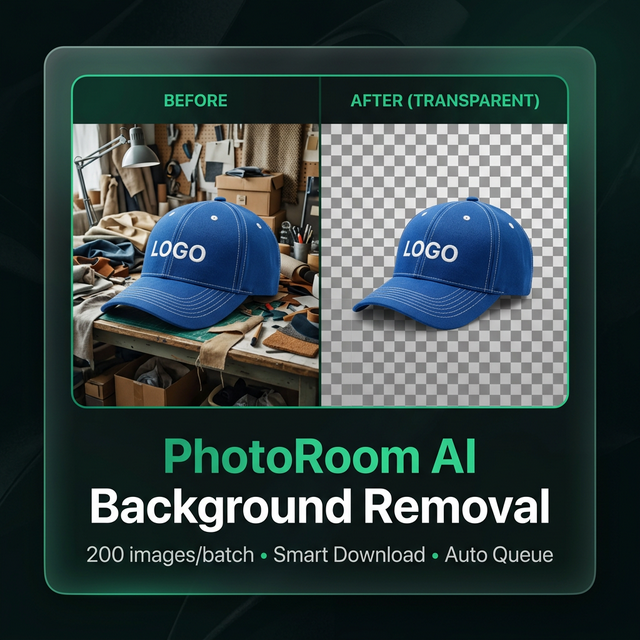

  

<h1 align="center">🖼️ Upscale Photo Pro</h1>

  <b>Công cụ nâng cấp ảnh AI & xóa nền hàng loạt — Tất cả trong một ứng dụng desktop</b>

  
  
  
  

  

---

## ✨ Tại sao chọn Upscale Photo Pro?

> **Upscale Photo Pro** là ứng dụng desktop tích hợp **3 công cụ xử lý ảnh AI** mạnh mẽ nhất — giúp bạn nâng cấp chất lượng ảnh, xóa nền sản phẩm, và upscale bằng AI Studio — tất cả chỉ trong **một cửa sổ duy nhất**.

- 🚀 **Xử lý offline** hoàn toàn — không cần internet cho upscale ONNX
- ⚡ **Hàng đợi thông minh** — kéo thả 100+ ảnh, xử lý liên tục
- 🎨 **Xóa nền hàng loạt** — tích hợp PhotoRoom, tự động 200 ảnh/batch
- 🤖 **AI Studio Cloud** — dùng Google Gemini upscale miễn phí 50 ảnh/ngày
- 🔄 **Auto Update** — tự động cập nhật phiên bản mới

---

## 🎯 3 Công Cụ Trong 1 Ứng Dụng

### 🖼️ Tab 1: Upscale Cục Bộ (ONNX)

| Tính năng | Chi tiết |
|-----------|----------|
| **7 Model AI** | Remacri, Ultrasharp, Digital Art, High Fidelity... |
| **Hệ số phóng** | 2× · 4× · 8× |
| **Xử lý** | 100% offline, dùng GPU/CPU trên máy |
| **Hàng đợi** | Kéo thả nhiều ảnh, mỗi ảnh chọn model & scale riêng |
| **So sánh** | Before/After slider trực quan |
| **Clipboard** | Ctrl+V dán ảnh thẳng vào hàng đợi |

### 🤖 Tab 2: AI Studio Upscale (Cloud)

| Tính năng | Chi tiết |
|-----------|----------|
| **Google Gemini AI** | Upscale thông minh với AI sinh ảnh |
| **19 Style** | Giữ gốc, Chân dung, Phong cảnh, Anime, Studio... |
| **Miễn phí** | 50 ảnh / ngày (Gmail miễn phí) |
| **Tự động** | Chrome chạy nền, không cần thao tác |

### 🎨 Tab 3: Xóa Nền AI (PhotoRoom)

| Tính năng | Chi tiết |
|-----------|----------|
| **PhotoRoom AI** | Xóa nền chất lượng cao, edge detection chính xác |
| **Batch 200 ảnh** | Upload → Xóa nền → Tải xuống tự động |
| **Chọn thư mục** | Chọn nguyên folder ảnh, xử lý hàng loạt |
| **Smart Download** | Đợi file tải xong mới đóng tab |
| **Không Timeout** | Đợi vô hạn — kể cả 200 ảnh cũng chờ |
| **Chrome ẩn** | Tự thu nhỏ 40%, không che ứng dụng |

---

## 🚀 Cài Đặt

### Yêu cầu hệ thống
- **Windows 10/11** (64-bit)
- **RAM:** 4GB+ (khuyến nghị 8GB+)
- **GPU:** Tùy chọn (tăng tốc ONNX)

### Tải về & Cài đặt

1. **[⬇️ Download bản mới nhất](https://github.com/dinhkhactientl2/upscale-pro/releases/latest)**
2. Chạy file `.exe` → cài đặt bình thường
3. Mở app → sẵn sàng sử dụng!

> 💡 **Auto Update:** App tự kiểm tra & cập nhật phiên bản mới khi khởi động.

---

## 📋 So sánh các Tab

| | Upscale ONNX | AI Studio | Xóa Nền |
|--|:----------:|:---------:|:-------:|
| **Kết nối** | ❌ Offline | ☁️ Cloud | ☁️ Cloud |
| **Tốc độ** | ⚡ Nhanh | 🕐 15-30s/ảnh | ⚡ 5-30s/batch |
| **Giới hạn** | ♾️ Không giới hạn | 50 ảnh/ngày | 1.500 ảnh/7 ngày |
| **Chất lượng** | ⭐⭐⭐⭐ | ⭐⭐⭐⭐⭐ | ⭐⭐⭐⭐⭐ |
| **Yêu cầu** | Máy mạnh | Gmail miễn phí | Gói PhotoRoom Max |
| **Output** | PNG/JPG | PNG/JPG | PNG (nền trong suốt) |

---

## 🆕 What's New — v28.0.0

- ✅ **Chọn thư mục** — Chọn nguyên folder ảnh, tự thêm tất cả vào hàng đợi
- ✅ **Chrome thu nhỏ** — Tự động thu Chrome còn 40% góc phải
- ✅ **Không timeout** — Đợi vô hạn cho đến khi xóa nền xong
- ✅ **Auto đóng popup** — Tự tắt QR code login, cookie consent
- ✅ **Smart download** — Đợi file tải xong mới đóng tab
- ✅ **Quota chính xác** — Hiển thị lượt còn lại ngay sau khi xong

---

## 📞 Liên hệ

- **Telegram:** Liên hệ admin để mua license
- **Issues:** [Báo lỗi tại đây](https://github.com/dinhkhactientl2/upscale-pro/issues)

---

  <b>Made with ❤️ by DKT Team</b>
   
  © 2026 Upscale Photo Pro. All rights reserved.

